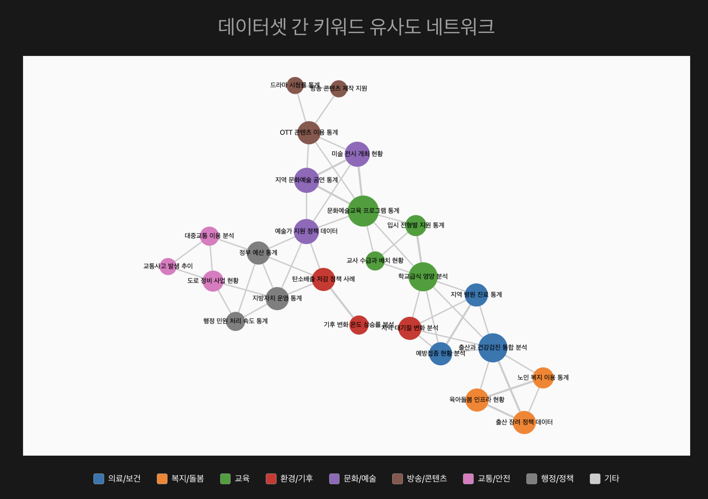

# DCAT 메타데이터 네트워크 분석 시스템

이 프로젝트는 **DCAT(Data Catalog Vocabulary) 기반 메타데이터**를 활용하여 데이터셋 간의 관계성을 자동으로 분석하고, **키워드 유사도 기반 네트워크 그래프**로 시각화하는 웹 애플리케이션입니다.

**직관적인 업로드 인터페이스**와 **동적 네트워크 시각화**를 통해 방대한 데이터셋 간의 연관성을 쉽게 탐색할 수 있습니다.

---

## 목적

이 프로젝트는 아래 연구개발 과제의 일환으로 수행되었습니다.

> **[과제명]**  
> 방대한 데이터 내에서 데이터 간 관계, 강도, 중요도 등을 시각적으로 확인하기 위해 자동으로 관계를 생성하고 시각화하는 기술 개발

---

## 주요 기능

### 데이터 업로드
- **드래그 앤 드롭**: 여러 JSON 파일을 한 번에 업로드
- **실시간 검증**: 업로드된 데이터의 형식과 유효성 자동 검사
- **통계 요약**: 총 데이터셋 수, 카테고리, 키워드 개수 실시간 표시
- **파일 관리**: 업로드된 파일 개별 제거 및 전체 초기화

### 네트워크 시각화
- **키워드 유사도**: 공통 키워드 기반 데이터셋 간 관계 강도 계산
- **시각적 인코딩**: 
  - 노드 크기: 연결 관계 수에 비례
  - 엣지 두께: 공통 키워드 수에 비례
  - 노드 색상: 카테고리별 구분
- **인터랙티브 탐색**: 줌, 팬, 드래그를 통한 자유로운 네트워크 탐색

### 워크플로우
- **2단계 인터페이스**: 업로드 화면 → 분석 결과 화면
- **상태 관리**: 업로드된 데이터 유지 및 재분석 지원
- **반응형 디자인**: 모바일 및 데스크톱 환경 모두 지원

---

## 데이터 형식

업로드할 JSON 파일은 다음과 같은 배열 형태의 구조를 가져야 합니다:

```json
[
  {
    "title": "데이터셋 제목",
    "description": "데이터셋에 대한 자세한 설명",
    "keyword": ["키워드1", "키워드2", "키워드3"],
    "category": "카테고리명"
  },
  {
    "title": "또 다른 데이터셋",
    "description": "다른 데이터셋의 설명",
    "keyword": ["키워드A", "키워드B"],
    "category": "다른카테고리"
  }
]
```

### 필수 필드
- **`title`** (string): 데이터셋의 제목
- **`description`** (string): 데이터셋에 대한 설명
- **`keyword`** (array): 데이터셋을 설명하는 키워드 배열
- **`category`** (string): 데이터셋이 속하는 카테고리

### 지원 카테고리
- 의료/보건, 복지/돌봄, 교육, 환경/기후, 문화/예술, 방송/콘텐츠, 교통/안전, 행정/정책, 기타
---

## 설치 및 실행

### 1. 프로젝트 클론 및 의존성 설치
```bash
git clone https://github.com/your-username/dcat-dataset-network.git
cd dcat-dataset-network
npm install
```

### 2. 개발 서버 실행
```bash
npm run dev
```

### 3. 브라우저에서 접속
```
http://localhost:5173
```

---

## 사용 방법

### Step 1: 데이터 업로드
1. 메인 화면에서 **JSON 파일을 드래그하거나 클릭**하여 업로드
2. 여러 파일을 한 번에 선택 가능
3. 업로드된 파일의 **통계 정보 확인** (데이터셋 수, 카테고리, 키워드)
4. **"네트워크 분석 시작"** 버튼 클릭

### Step 2: 네트워크 분석 결과 확인
1. **키워드 유사도 기반 네트워크 그래프** 확인
2. **노드와 엣지 정보**:
   - 노드 크기 = 다른 데이터셋과의 연결 수
   - 엣지 두께 = 공통 키워드 수
   - 노드 색상 = 카테고리 구분
3. **"새 데이터 업로드"** 버튼으로 새로운 분석 시작

---

## 기술 스택

- **Frontend**: Vue.js 3, Vite
- **시각화**: Cytoscape.js
- **스타일링**: CSS3 (Flexbox, Grid)
- **데이터 처리**: JavaScript (ES6+)

---

## 결과물 예시



*키워드 유사도를 기반으로 한 데이터셋 네트워크 시각화 결과*
